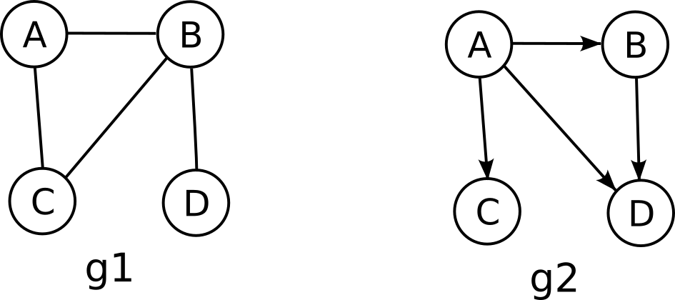

## Grafos

Grafos são usados para representar conexões entre entidades, de forma mais livre que as estruturas anteriores.
Seu campo de aplicação é vasto: podem ser usados para representar a internet (os computadores e as conexões que a compõem), um mapa de estradas (as cidades e as estradas que as ligam), um mapa de relações em uma rede social, as ligações entre páginas da internet, etc.
Com uma estrutura de dados que representa uma dessas aplicações, pode-se executar algoritmos para realizar análises sobre essa estrutura.
Qual o menor caminho entre duas cidades? 
Qual o caminho mais barato para fazer um percurso entre tais cidades em um passeio de férias?
Por quantos switches passa um pacote para ir do computador A para o B?
Por onde passar fibra entre os prédios do câmpus de forma a interligá-los todos pelo menor custo?
Tal arquivo foi alterado, quais programas devem ser recompilados em função dessa alteração?
Para instalar este nov
o programa, quais outros programas e/ou bibliotecas devem ser instalados ou atualizados?

Formalmente, um grafo `G` é definido como dois conjuntos, um conjunto `V` de **vértices** ou nós e um conjunto `E` de **arestas** ou arcos, que representam conexões entre esses vértices (`G = (V, E)`). O conjunto V não pode ser vazio, o E pode.
("E" vem de *edge*, muitos autores traduzem como "A")

Se as arestas são bi-direcionais (se x conecta a y então y conecta a x), o grafo é dito **não orientado**. Cada aresta é representada por um conjunto contendo 2 nós, escrita com a identificação dos dois nós entre chaves -- uma aresta entre `a` e `b` é escrita assim: `{a,b}`.
Se, ao contrário, as arestas têm direção definida, o grafo é chamado de **orientado**, ou **digrafo** (do inglês digraph -- directed graph). Cada aresta é representada por um par ordenado de vértices, escrito com a identificação dos dois nós entre parênteses -- uma aresta de `a` para `b` é escrita assim: `(a,b)`, e uma de `b` para `a`, `(b,a)`. Nem todo mundo segue essa convenção de escrita, representando arestas como `v-w`, alguns representam pares ordenados como `<a,b>`, alguns não diferenciam na escrita entre ordenados e não ordenados, esclarecendo na descrição do grafo, etc.

O grafo g1 da figura abaixo pode ser representado assim:
```
g1(V,E)
V={A, B, C, D}
E={{A,B},{A,C},{B,C},{D,B}}
```
O grafo g2 pode ser representado assim:
```
g2(V,E)
V={A, B, C, D}
E={(A,B),(A,C),(A,D),(B,D)}
```




Um grafo pode ser **ponderado** ou **valorado**, quando se tem um valor numérico associado a cada vértice ou, mais comumente, a cada aresta. Esse valor pode representar, por exemplo, o custo para se percorrer o caminho representado por essa aresta.

Dois vértices são **adjacentes** ou **vizinhos** se existe uma aresta ligando-os.
Diz-se que essa aresta é **incidente** a esses vértices.
Se é um digrafo, o nó de partida da aresta é dito antecessor e o de chegada é o sucessor.

O **grau** de um nó é o número de arestas que incidem sobre ele. Se o grafo for orientado, divide-se em grau de saída (ou emissão) e grau de entrada (ou recepção). Um nó é chamado de fonte se o grau de recepção for 0, e de sumidouro se o grau de emissão for 0.
Se todos os nós têm o mesmo grau, o grafo é chamado de **regular**. 
Se todos os nós tem arestas com todos os demais, o grafo é chamado de **completo**.

Um **laço** é uma aresta que une um nó a ele mesmo.

Um **caminho** é uma sequência de vértices *(v<sub>0</sub>, v<sub>1</sub>, v<sub>2</sub>, .., v<sub>n</sub>)*, em que *v<sub>0</sub>* a *v<sub>n</sub>* pertencem a *V*, e todos os pares consecutivos no caminho *(v<sub>i</sub>,v<sub>i+1</sub>)* pertencem a *E* (ou *{v<sub>i</sub>,v<sub>i+1</sub>}* no caso de grafo não orientado). Esse caminho une o vértice *v<sub>0</sub>* ao vértice *v<sub>n</sub>* e tem comprimento *n*.
Se não existem vértices repetidos em um caminho, ele é dito **simples**.
Se o primeiro e o último vértice de um caminho são o mesmo, esse caminho é chamado de **ciclo**.

Se existe um caminho ligando *a* a *b*, diz-se que *b* é **alcançável** a partir de *a*. 
Se existe um caminho interligando todos os vértices de um grafo, esse grafo é chamado de **conexo**.
No caso de grafo orientado, ele é chamado de **fortemente conexo** se existe pelo menos um caminho que conecta cada dois vértices em cada sentido, os seja, se todos os nós são alcançáveis a partir de qualquer nó.

### Percursos em um grafo

Da mesma forma que em árvores, os percursos mais usuais em grafos são o percurso em profundidade e o percurso em largura.
A implementação deles em grafos é muito semelhante à implementação em árvores. As principais diferenças advém do fato que em árvores tem-se um nó principal (a raiz), e num grafo não, e que em um grafo podem existir ciclos, ou mais de um caminho (ou nenhum) para se chegar a um mesmo nó, algo que não é possível em uma árvore.

Essas diferenças podem fazer com que um nó nunca seja visitado, ou seja visitado mais de uma vez. Para evitar isso, alteramos os algoritmos de percurso de duas formas: uma que considera cada um dos nós como início do percurso, e outra que marca cada nó visitado, para evitar visitar um nó mais de uma vez.
Para isso, ou se coloca uma variável a mais em cada nó, para marcá-lo, ou se usa uma estrutura auxiliar durante o percurso para identificar os nós que já foram visitados. De qualquer forma, tem um trabalho a mais no início do percurso, para inicializar essas marcas.

#### Percurso em profundidade

```
percurso_profundidade(grafo g):
   para cada nó n em g.V       // nenhum nó foi visitado ainda
      desmarca(n)
   para cada nó n em g.V       // inicia o percurso em cada nó que ainda não foi visitado
      if nao_marcado(n)
         percorre_prof(g, n)

percorre_prof(grafo g, vertice n):
   if nao_marcado(n)
      visita(n)
      marca(n)
      para cada nó a adjacente a n em g
         percorre_prof(g, a)
```

#### Percurso em largura

```
percurso_largura(g):
   fila f
   para cada nó n em g.V       // nenhum nó foi visitado ainda
      desmarca(n)
   para cada nó n em g.V       // inicia o percurso em cada nó que ainda não foi visitado
      if nao_marcado(n)
         insere(f, n)
      while !vazia(f)
         m = remove(f)
         if nao_marcado(m)
            visita(m)
            marca(m)
            para cada nó a adjacente a m em g   // coloca os vizinhos na fila para visita futura
               if nao_marcado(a)
                  insere(f, a)
```

### Implementação de grafos

Tem duas ideias principais de se implementar grafos, com listas de adjacências e com matriz de adjacências.

Na primeira, se mantém um conjunto de listas, chamadas **listas de adjacências**, uma lista para cada nó.
Cada lista contém uma entrada para cada aresta que parte desse nó.
Cada entrada contém o nó destino dessa aresta.

Por exemplo, o grafo orientado `g3` composto pelos conjuntos `V` e `E` abaixo:
```
   V = {a, b, c, d, e}
   E = {(a,b), (a,c), (c,b), (d,b), (d,d), (d,e), (e,b)}
```
seria implementado pelas 5 listas abaixo, uma para cada nó:
```
   a -> [ b, c ]
   b -> [ ]
   c -> [ b ]
   d -> [ b, d, e ]
   e -> [ b ]
```
Os nós podem ser nomeados por números, e as listas armazenadas em um vetor indexado por esses números, ou poderia ter uma estrutura para mapear a identificação de um nó para sua posição no vetor. Pode ser também uma lista de listas em vez de um vetor.

O grafo `g4` composto pelos conjuntos `V` e `E` abaixo:
```
   V = {a, b, c, d, e}
   E = {{a,b}, {a,c}, {c,b}, {d,b}, {d,d}, {d,e}, {e,b}}
```
seria implementado pelas 5 listas abaixo, uma para cada nó:
```
   a -> [ b, c ]
   b -> [ a, c, d, e ]
   c -> [ a, b ]
   d -> [ b, d, e ]
   e -> [ b, d ]
```

Na implementação com **matriz de adjacências**, usa-se uma matriz quadrada, com uma linha e uma coluna para cada nó do grafo.
Cada elemento da matriz contém um valor que diz se existe uma aresta que vai do nó correspondente à linha desse elemento até o nó correspondente à coluna desse elemento.
Se o grafo for não orientado, a matriz será simétrica.

Os grafos `g3` e `g4` acima seriam implementados pelas matrizes abaixo:
```
g3 a b c d e
a  0 1 1 0 0
b  0 0 0 0 0
c  0 1 0 0 0
d  0 1 0 1 1
e  0 1 0 0 0
```
```
g4 a b c d e
a  0 1 1 0 0
b  1 0 1 1 1
c  1 1 0 0 0
d  0 1 0 1 1
e  0 1 0 1 0
```

No caso de grafos ponderados, se houver valores associados aos nós, em geral se implementa um vetor para conter esses valores.
Para arestas ponderadas, no caso de listas cada entrada na lista contém, além do nó destino da aresta o seu peso; no caso de matriz de adjacências, em vez de se colocar zero ou um em cada posição da matriz, coloca-se o valor do peso da aresta. Caso seja possível ter aresta com peso zero, usa-se um outro valor para representar uma aresta inexistente.

O percurso em profundidade visto anteriormente poderia ser implementado em um grafo representado por uma matriz assim:
```c
void percurso_profundidade(int n_nos, bool grafo[n_nos][n_nos])
{
  bool marcado[n_nos];
  for (int no = 0; no < n_nos; no++) marcado[no] = false;  // todos desmarcados
  for (int no = 0; no < n_nos; no++) {
    if (!marcado[no]) {
      percorre_profundidade(n_nos, grafo, marcado, no);
    }
  }
}

void percorre_profundidade(int n_nos, bool grafo[n_nos][n_nos], 
                           bool marcado[n_nos], int no)
{
  if (!marcado[no]) {
    visita(no);
    marcado[no] = true;
    for (int adj = 0; adj < n_nos; adj++) {
      if (grafo[no][adj]) {
        percorre_profundidade(n_nos, grafo, marcado, adj);
      }
    }
  }
}
```
Uma possível implementação do percurso em largura em um grafo implementado como um vetor de listas está abaixo.
```c
void percurso_largura(int n_nos, lista grafo[n_nos])
{
  bool marcado[n_nos];
  for (int no = 0; no < n_nos; no++) marcado[no] = false;  // todos desmarcados
  fila f;
  f = fila_cria();
  for (int no = 0; no < n_nos; no++) {
    insere(f, no);
    while (!fila_vazia(f)) {
      int m = fila_remove(f);
      if (marcado[m]) continue;
      visita(m);
      marcado[m] = true;
      int adj;
      for (lista_inicia_percurso(grafo[m]); lista_proximo_dado(grafo[m], &adj); ) { // lista_proximo_dado retorna false se terminar
        fila_insere(f, adj);
      }
    }
  }
  fila_destroi(f);
}
```

Quando o grafo é implementado como uma matriz de adjacências, é comum que essa matriz tenha a maioria de seus elementos com valor 0, o que caracteriza uma matriz esparsa. Existem métodos alternativos de se representar uma matriz assim.

### Matriz esparsa

Uma matriz é dita esparsa quando contém a grande maioria de seus elementos com o mesmo valor, geralmente 0.
Grandes matrizes esparsas são comuns em áreas como simulação em matemática e engenharia, em grandes grafos e em alguns casos de processamento de imagens.
Não é incomum que essas matrizes sejam grandes a ponto de impossibilitar a implementação de algoritmos na memória disponível, e a grande maioria dessa memória é usada para armazenar zeros. 
Uma estrutura de dados otimizada poderia armazenar somente os valores diferentes de zero, potencialmente economizando grande quantidade de memória.

Claro que, além dos valores não-zero, necessita-se de mais informação, para localizar eses valores em suas posições corretas na matriz.
Várias formas de representação de matrizes esparsas são usadas.

Uma delas é armazenar os valores não zero em uma estrutura de busca, usando as coordenadas (linha e coluna) do valor como chave.
Para acessar um valor da matriz, busca-se pelas coordenadas na estrutura, e se não for encontrado, o valor é considerado zero.

Outra ideia é armazenar com listas, uma para cada linha (ou coluna), contendo os elementos não zero dessa linha, cada um com a coluna respectiva. O acesso a um elemento da matriz consiste em buscar pela coluna na lista correspondente à linha.
Ordenando-se por coluna dentro da lista a busca pode ser otimizada. Mais ainda se a lista for implementada como um vetor, em que se pode fazer uma busca binária.

Uma outra forma é armazenar a matriz em 3 vetores do mesmo tamanho, um deles contendo todos os elementos não zero, outro contendo a coluna correspondente a cada valor e o terceiro contendo a linha. Se os dados forem armazenados nesses vetores em ordem de linha (todos os dados da primeira linha seguidos pelos da segunda etc), o vetor que contém as informações de linha vai conter vários valores repetidos seguidos (tantos quantos forem os dados não zero contidos em uma linha). Pode-se comprimir essa informação, e chega-se ao formato de matriz esparsa conhecido como "Yale".

Nesse formato, usa-dois vetores, um com os dados não zero e outro com o número da coluna de cada dado (esse vetores têm tamanho correspondente ao número de elementos não zero na matriz) e um terceiro vetor, contendo a posição nos vetores anteriores onde está o primeiro elemento de cada linha (ou onde estaria, caso essa linha não tenha nenhum elemento).
Esse terceiro vetor contém um valor a mais no final, que contém a posição onde estaria o primeiro elemento da linha seguinte, caso ela existisse (esse valor corresponde ao número de elementos não nulos). Esse vetor tem, portanto, tamanho correspondente ao número de linhas na matriz, mais um.

Por exemplo, abaixo está uma matriz esparsa 5x10 com 7 elementos não zero (os zeros não estão representados) e os 3 vetores usados para representá-la.
```
     0 1 2 3 4 5 6 7 8 9
   0       2       1
   1     4             9
   2 
   3           3     
   4 7           8
   
   val 2 1 4 9 3 7 8    <- os elementos não zeros, em ordem de linha
   col 3 7 2 9 5 0 6    <- a coluna onde cada elemento do vetor anterior está
   lin 0 2 4 4 5 7      <- o índice nos vetores anteriores onde está o 1o elemento de cada linha
```
Para encontrar um elemento (digamos, na posição *<i,j>*) da matriz nesses vetores, inicialmente descobre-se os índices dos vetores `val` e `col` que contêm os elementos da linha desejada. O vetor `lin` contém o índice do primeiro elemento de cada linha, então o primeiro índice sai direto desse vetor. O último índice é logo antes de onde está o primeiro da linha seguinte, que também está nesse vetor.
```c
   tipo valor_na_pos(int i, int j)
   {
      tipo dado = 0; // dado a ser retornado, inicializado em 0 para o caso de nao ser encontrado
      int ii = lin[i];    // onde começa a linha desejada
      int is = lin[i+1];  // onde começa a linha seguinte
      int p;
      for (p = ii; p < is; p++) {  // procura nessas posições
        if (col[p] == j) {  // achei!
          dado = val[p];
          break;
        }
        if (col[p] > j) break; // as colunas estão em ordem
      }
      return dado;
    }
```
Quando atribui um valor a uma posição da matriz, quatro situações podem acontecer:
- o valor é zero, e a posição não é encontrada - deixa assim, posição não encontrada representa valor zero;
- o valor é zero, e a posição é encontrada - remove o valor da matriz;
- o valor não é zero, e a posição não é encontrada - insere o valor na matriz;
- o valor não é zero e a posição é encontrada - substitui o valor no vetor `val`.

A atribuição pode ser implementada com código semelhante ao acima (até antes do `return`). No final do laço, `p` contém a posição nos vetores `val` e `col` do dado a ser removido ou onde o dado deve ser inserido. Os vetores devem ser aumentados ou diminuídos e os valores dessa posição até o final devem ser movimentados para a posição seguinte ou anterior. Os valores do vetor `lin` em todas as posições à partir de `i+1` devem ser decrementados ou incrementados de 1.
A decisão sobre o que fazer pode ser tomada analisando o valor de `dado` e o valor a atribuir, de acordo com as situações acima.

Uma implementação equivalente poderia ser feita armazenando por coluna em vez de linha.
